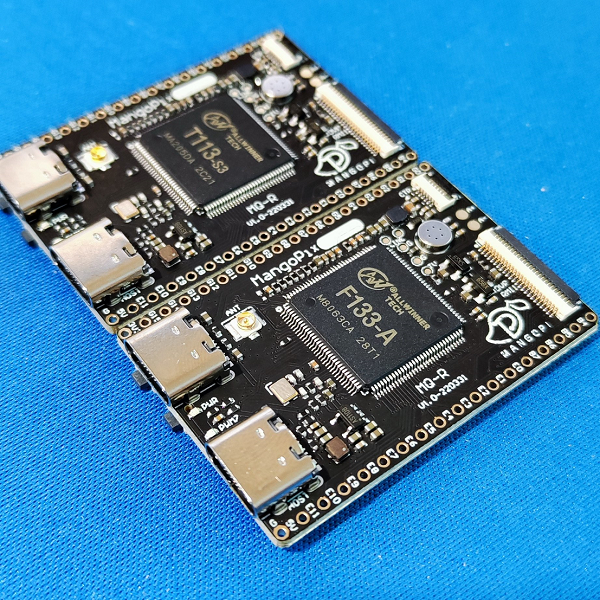
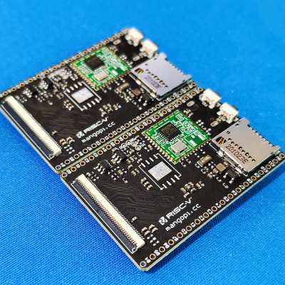
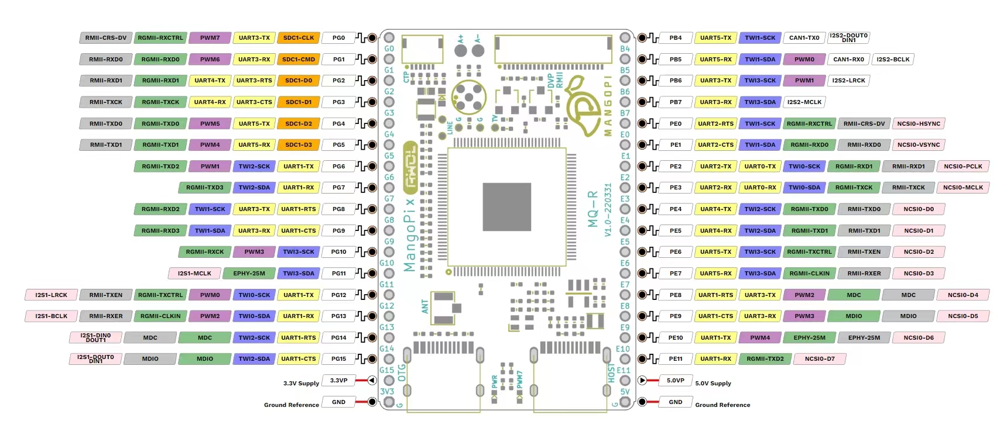

|                                                              |                                        |
| ------------------------------------------------------------ | -------------------------------------- |
|  |  |

## Spectification

- F133(d1s) with 64MB DDR2, RISC-V core up to 1GHz
- T113 with 128MB DDR3, Dual-Core A7 up to 1GHz
- USB-OTG Type-C
- USB-HOST Type-C
- 18Pin expand x2
- TF card
- RTL8189F WiFi or RTL8723ds WiFi/BT module
- 40Pins RGB FPC connector
- 6Pins CTP FPC connector
- MIC x 1
- 24Pins DVP FPC connector
- Fel,reset button
- 3x4.5cm size

## Model

- MQ1RW：F133 CPU, RTL8189F WiFi
- MQ1R: F133 CPU, no WiFi
- MQ1RDW: T113 CPU, RTL8189F WiFi
- MQ1RDW2: T113 CPU, RTL8723ds WiFi version

## Pinout

