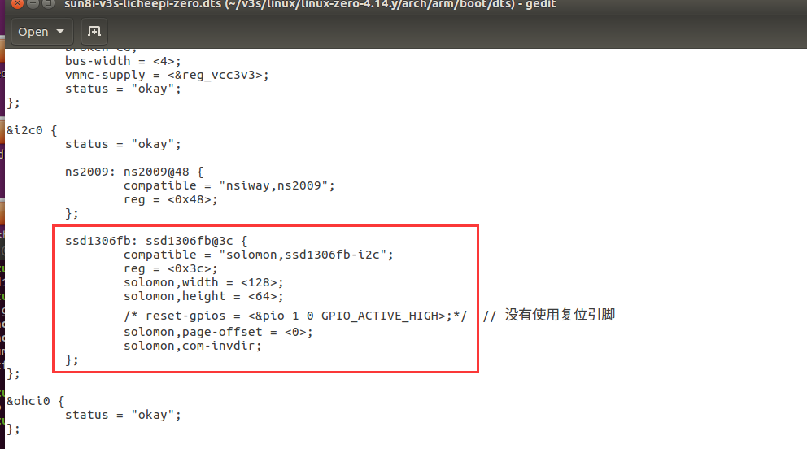
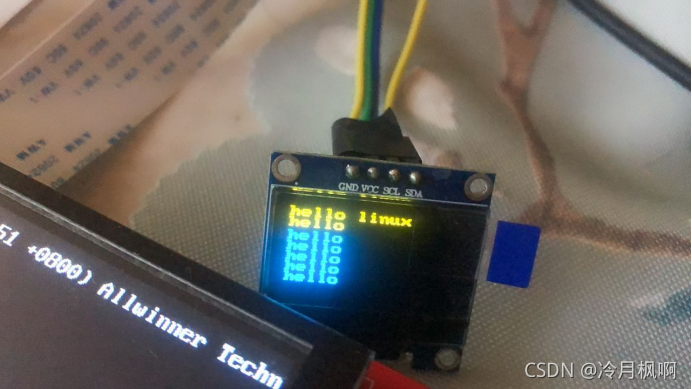

# SSD1306

[参考](https://blog.csdn.net/lengyuefeng212/article/details/120042419) 

```bash
# 开启内核模块
$ make menuconfig
Device Drivers                 
-> Graphics support             
  -> Frame buffer Devices       
  	 <*> Solomon SSD1307 framebuffer support    

# 挂载节点
$ gedit sun8i-v3s-licheepi-zero.dts

&i2c0{

	...
	
    ssd1306fb: ssd1306fb@3c {
        compatible = "solomon,ssd1306fb-i2c";
        reg = <0x3c>;
        solomon,width = <128>;
        solomon,height = <64>;
       /* reset-gpios = <&pio 1 0 GPIO_ACTIVE_HIGH>;*/  // 没有使用复位引脚 
        solomon,page-offset = <0>;
        solomon,com-invdir;
    };
    
    ...
};

# 编译设备树
$ make ARCH=arm CROSS_COMPILE=arm-linux-gnueabihf- dtbs

# 枚举屏幕 (另外1个是RGB屏)
$ ls /dev/fb*
/dev/fb0  /dev/fb1

# 让屏幕出现花屏现象
$ cat /dev/urandom > /dev/fb0

# 清除屏幕
$ cat /dev/zero > /dev/fb0

# 显示图片
$ ./ssd1306_show_image
The mem is :1024
The line_length is :16
The xres is :128
The yres is :64
bits_per_pixel is :1
screensize: 1024
timer1
timer2
```








## 修改屏幕显示终端信息

修改屏幕显示终端信息

在uboot修改bootargs

```
setenv bootargs root=/dev/nfs rw nfsroot=192.168.1.4:/home/luatao/linux/nfs/rootfs ip=192.168.1.50:192.168.1.4:192.168.1.1:255.255.255.0::eth0:off init=/linuxrc console=ttyS0,115200 console=tty0
```

在屏幕上就会打印出启动的信息，但实在是太慢了。（受不了）

还是改回去

```
setenv bootargs root=/dev/nfs rw nfsroot=192.168.1.4:/home/luatao/linux/nfs/rootfs ip=192.168.1.50:192.168.1.4:192.168.1.1:255.255.255.0::eth0:off init=/linuxrc console=ttyS0,115200
```