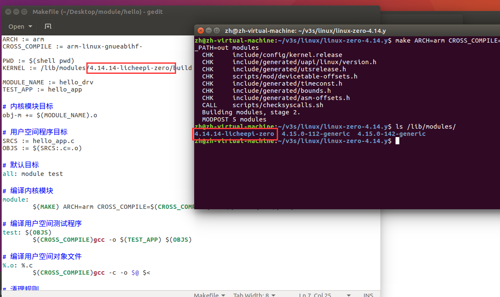
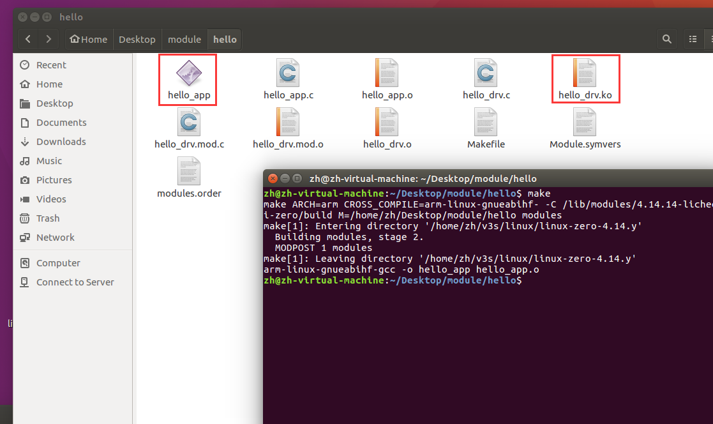

# 自定义字符驱动

[参考](https://blog.csdn.net/qq_41839588/article/details/130504587) 

## 配置内核

```bash
$ pwd
/home/zh/v3s/linux/linux-zero-4.14.y

$ ls /lib/modules/
4.14.14-licheepi-zero  4.15.0-112-generic  4.15.0-142-generic
```

根据实际情况修改 Makefile 中的目标内核



## 构建程序

```bash
$ make
```



构建完成后将 内核模块(.ko) 和 测试程序 复制到开发板中。

## 测试

```bash
# 分配权限
$ chmod 777 ./*

# 安装内核模块
$ insmod hello_drv.ko

# 枚举已安装的模块
$ lsmod
Module                  Size  Used by    Tainted: G
hello_drv              16384  0

# 查看主设备号
$ cat /proc/devices
Character devices:
...
200 hello_drv
...

Block devices:
...

# 创建设备节点文件
# 字符设备: c; 主设备号: 200; 次设备号 0
$ mknod /dev/hello_drv c 200 0

# 写入字符串
$ ./hello_app -w hello,v3s

# 读出字符串
$ ./hello_app -r
APP read : hello,v3s

# 卸载驱动
$ rmmod hello_drv.ko
```

