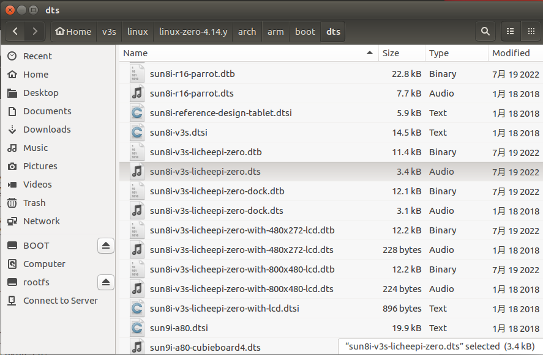
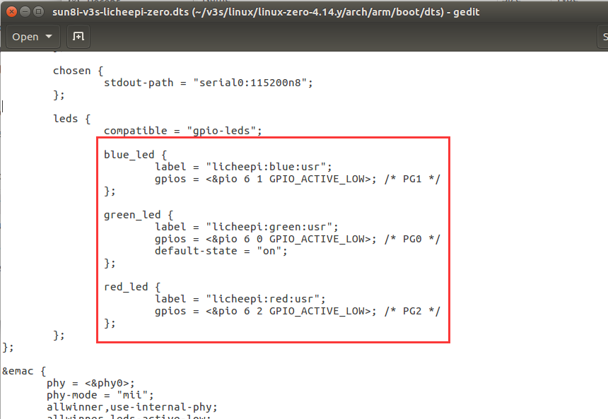
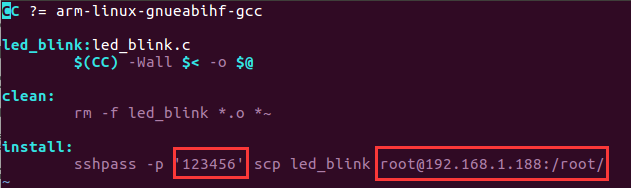

# Device Tree





# Generic

```bash
# 在虚拟机中编译
$ arm-linux-gnueabihf-gcc -o led_blink led_blink.c 

# 将程序复制到开发板中
$ scp led_blink root@192.168.1.188:/root/

# 提升权限
$ chmod 777 ./led_blink

# 查看帮助信息
$ ./led_blink -h
Usage: led_blink [options]

Options:
 -n | --number        Number of LEDs, range of 1 to 3
 -v | --version       Display version information
 -h | --help          Show help content

# led 闪烁
$ ./led_blink -n 1
```

# Makefile

```bash
# 编译
$ make

# 复制到开发板
$ make install
```

## 注意

1. 需在虚拟机上安装 sshpass 工具

```bash
sudo apt-get install sshpass
```

2. 需配置开发板的 ssh 用户名，密码，目标路径

