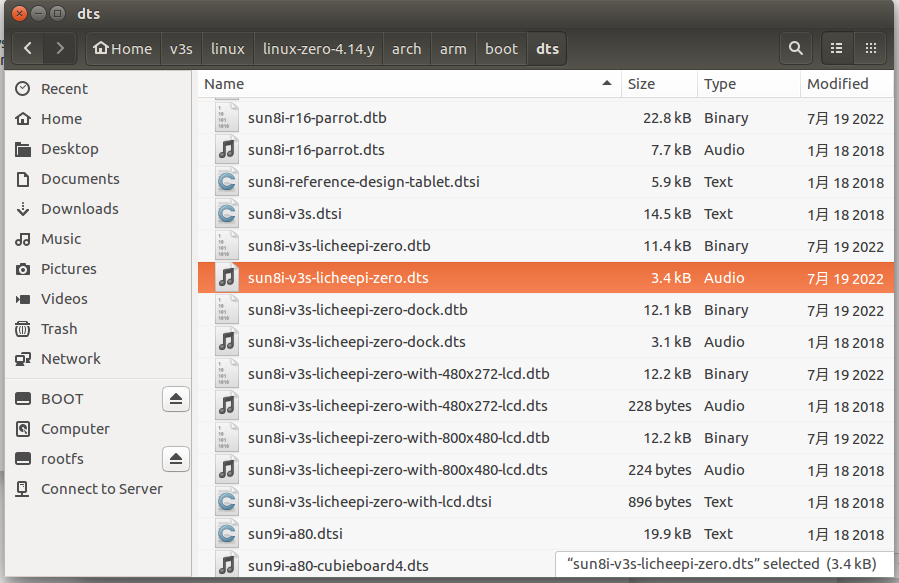
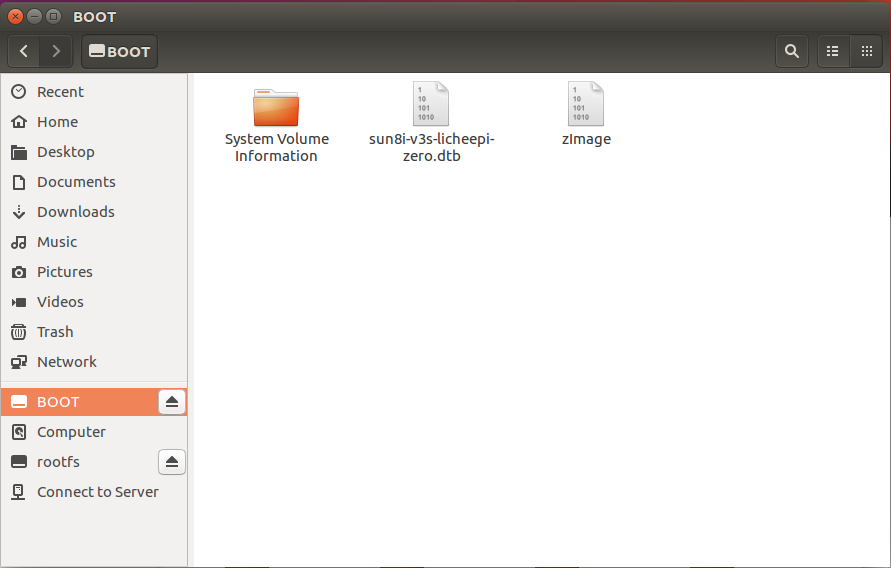

Device Tree 是一种描述硬件的数据结构，

## 板载设备树

```bash
cd /sys/firmware/devicetree/base
ls
```

## 反编译设备树

```bash
dtc -I dtb -O dts xxx.dtb -o xxx.dts
```

* `dtc`：处理设备树的工具（Device Tree Compiler）。

- `-I dtb`：指定输入文件的格式为设备树二进制格式（Device Tree Blob，`.dtb`）。
- `-O dts`：指定输出文件的格式为设备树源代码格式（Device Tree Source，`.dts`）。
- `xxx.dtb`：输入的设备树二进制文件。
- `-o xxx.dts`：指定输出的设备树源代码文件

## 更改设备树

编辑 `arch/arm/boot/dts/sun8i-v3s-licheepi-zero.dts` 



## 更新设备树

### TF Card

拔下来，插到电脑上，会识别到 BOOT 和 rootfs，替换 dtb 文件即可。

