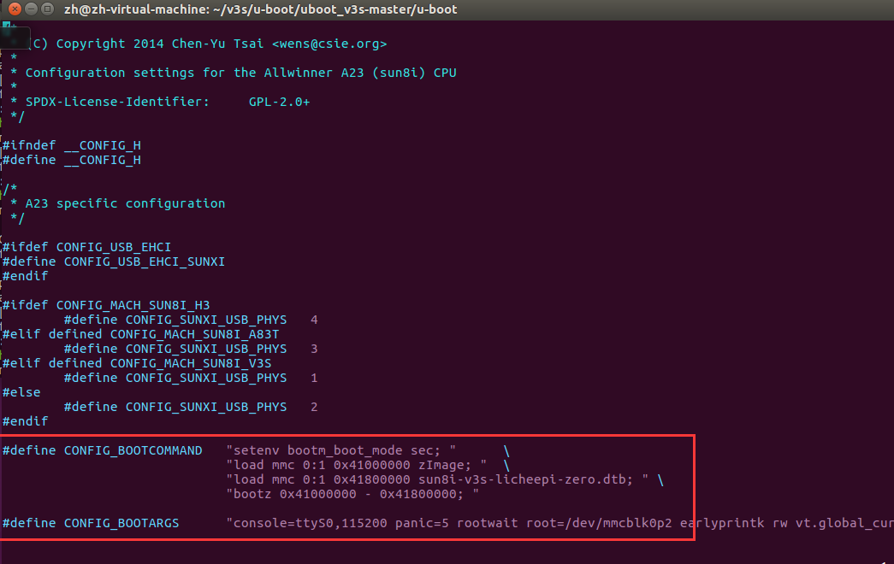

# U-Boot

## 目录结构

```
├── api                存放uboot提供的API接口函数
├── arch               平台相关的部分我们只需要关心这个目录下的ARM文件夹
│   ├──arm
│   │   └──cpu
│   │   │   └──armv7
│   │   └──dts	
│   │   │   └──*.dts 存放设备的dts,也就是设备配置相关的引脚信息
├── board              对于不同的平台的开发板对应的代码
├── cmd                顾名思义，大部分的命令的实现都在这个文件夹下面。
├── common             公共的代码
├── configs            各个板子的对应的配置文件都在里面，我们的Lichee配置也在里面
├── disk               对磁盘的一些操作都在这个文件夹里面，例如分区等。
├── doc                参考文档，这里面有很多跟平台等相关的使用文档。
├── drivers            各式各样的驱动文件都在这里面
├── dts                一种树形结构（device tree）这个应该是uboot新的语法
├── examples           官方给出的一些样例程序
├── fs                 文件系统，uboot会用到的一些文件系统
├── include            头文件，所有的头文件都在这个文件夹下面
├── lib                一些常用的库文件在这个文件夹下面  
├── Licenses           这个其实跟编译无关了，就是一些license的声明
├── net                网络相关的，需要用的小型网络协议栈
├── post              上电自检程序
├── scripts           编译脚本和Makefile文件
├── spl               second program loader，即相当于二级uboot启动。
├── test              小型的单元测试程序。
└── tools             里面有很多uboot常用的工具。
```

## 编译指南

1. 进入 u-boot 目录

```bash
cd /home/zh/v3s/u-boot/uboot_v3s-master/u-boot
```

> 不要使用 u-boot-2022.04 及以上版本，可能报提示编译器版本过高等错误。

2. 屏幕配置

不同屏幕不同配置（在 configs 文件夹下）

```bash
# 默认
make ARCH=arm CROSS_COMPILE=arm-linux-gnueabihf- LicheePi_Zero_defconfig

# 4.3 普清屏
make ARCH=arm CROSS_COMPILE=arm-linux-gnueabihf- LicheePi_Zero_480x272LCD_defconfig

# 4.3 高清屏（7.0 普清） 
make ARCH=arm CROSS_COMPILE=arm-linux-gnueabihf- LicheePi_Zero_800x480LCD_defconfig
```

3. TF 卡启动

```bash
vim include/configs/sun8i.h
```



4. 配置

```bash
make ARCH=arm menuconfig
```

5. 编译

```bash
ARCH=arm CROSS_COMPILE=arm-linux-gnueabihf- make -j4
```


6. 烧录

```bash
sudo dd if=u-boot-sunxi-with-spl.bin of=/dev/sdb bs=1024 seek=8
```

