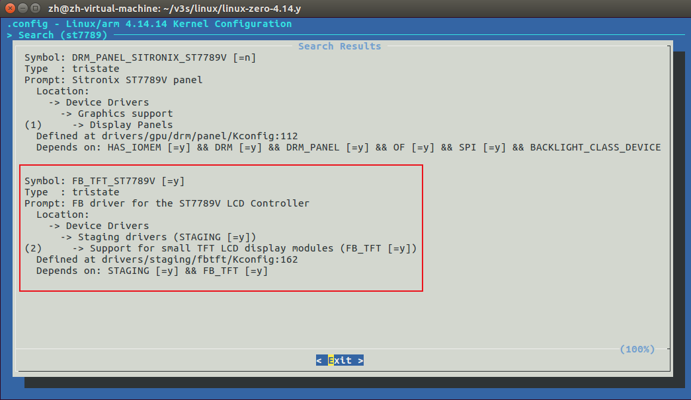
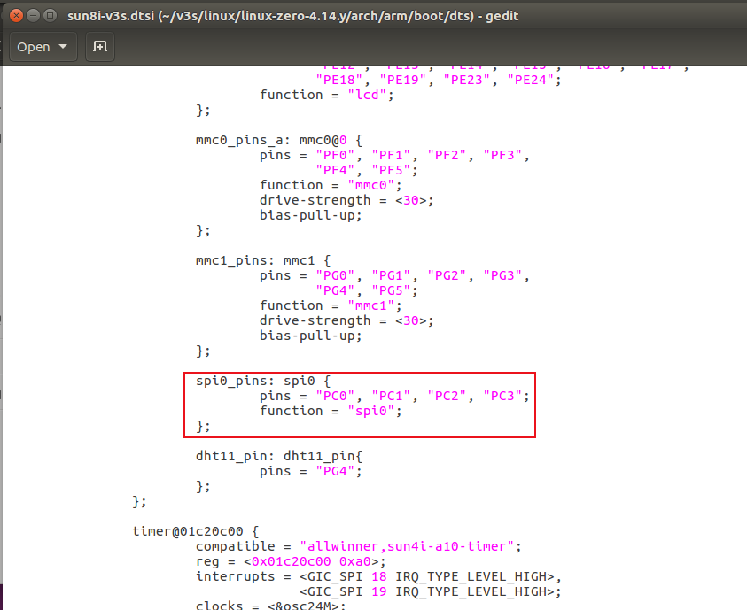
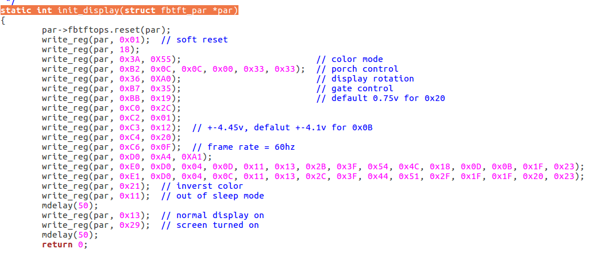
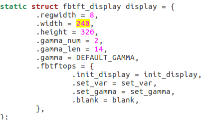

## menuconfig

开启内核驱动



## 设备树

`sun8i-v3s.dtsi`



```
spi0_pins: spi0 {
    pins = "PC0", "PC1", "PC2", "PC3";
    function = "spi0";
};
```

`sun8i-v3s-licheepi-zero.dts`

```
&spi0 {
        pinctrl-names = "default";
        pinctrl-0 = <&spi0_pins>;
        status = "okay";
        spi-max-frequency = <10000000>;

        st7789v: st7789v@0 {
                #address-cells = <1>;
                #size-cells = <1>;
                compatible = "sitronix,st7789v";
                reg = <0>;
                spi-max-frequency = <10000000>;
                rgb;
                buswidth = <8>;
                rotate = <90>;
                fps = <60>;
                spi-cpol;
                spi-cpha;
                reset-gpios = <&pio 6 3 GPIO_ACTIVE_HIGH>;     /* PG3 */
                dc-gpios = <&pio 6 5 GPIO_ACTIVE_LOW>;         /* PG5 */
                debug = <1>;
        };
};
```

## 驱动

`fb_st7789v.c`

```c
// 屏幕初始化 (不同厂家初始化命令不一定相同，需根据屏幕型号来更改)
static int init_display(struct fbtft_par *par)
{
	par->fbtftops.reset(par);
	write_reg(par, 0x01);  // soft reset
	write_reg(par, 18);
	write_reg(par, 0x3A, 0X55);                          // color mode
	write_reg(par, 0xB2, 0x0C, 0x0C, 0x00, 0x33, 0x33);  // porch control
	write_reg(par, 0x36, 0XA0);                          // display rotation
	write_reg(par, 0xB7, 0x35);                          // gate control
	write_reg(par, 0xBB, 0x19);                          // default 0.75v for 0x20
	write_reg(par, 0xC0, 0x2C);
	write_reg(par, 0xC2, 0x01);
	write_reg(par, 0xC3, 0x12);  // +-4.45v, defalut +-4.1v for 0x0B
	write_reg(par, 0xC4, 0x20);
	write_reg(par, 0xC6, 0x0F);  // frame rate = 60hz
	write_reg(par, 0xD0, 0xA4, 0XA1);
	write_reg(par, 0xE0, 0xD0, 0x04, 0x0D, 0x11, 0x13, 0x2B, 0x3F, 0x54, 0x4C, 0x18, 0x0D, 0x0B, 0x1F, 0x23);
	write_reg(par, 0xE1, 0xD0, 0x04, 0x0C, 0x11, 0x13, 0x2C, 0x3F, 0x44, 0x51, 0x2F, 0x1F, 0x1F, 0x20, 0x23);
	write_reg(par, 0x21);  // inverst color
	write_reg(par, 0x11);  // out of sleep mode
	mdelay(50);
	write_reg(par, 0x13);  // normal display on
	write_reg(par, 0x29);  // screen turned on
	mdelay(50);
	return 0;
}

// 屏幕参数
static struct fbtft_display display = {
	.regwidth = 8,
	.width = 240,
	.height = 320,
	.gamma_num = 2,
	.gamma_len = 14,
	.gamma = DEFAULT_GAMMA,
	.fbtftops = {
		.init_display = init_display,
		.set_var = set_var,
		.set_gamma = set_gamma,
		.blank = blank,
	},
};
```



