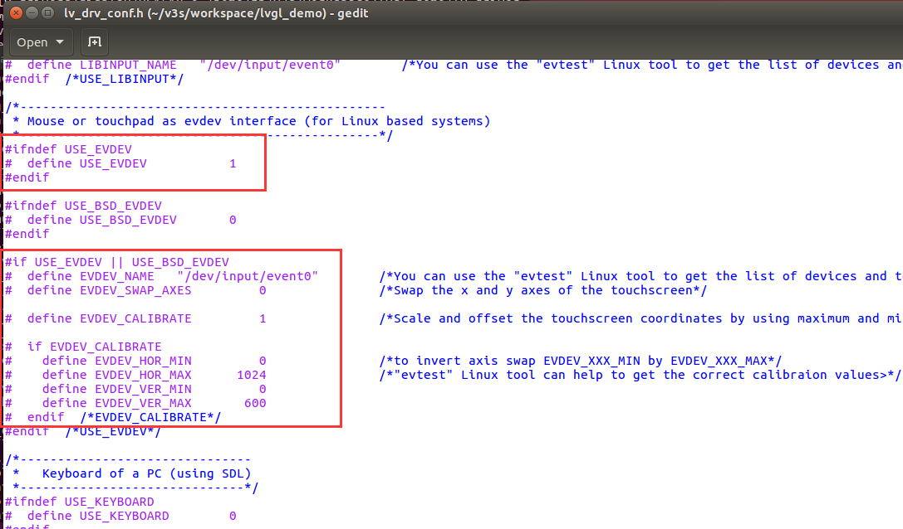
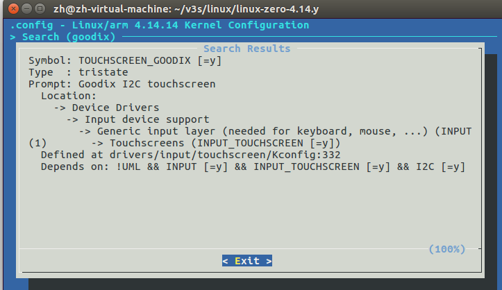

### 


## LVGL

## TouchScreen

`lv_drv_conf.h`



**开启触摸**：USE_EVDEV = 1

**配置输入设备**：EVDEV_NAME = "/dev/input/event0" 

```bash
# 枚举输入设备
$ cat /proc/bus/input/devices
I: Bus=0018 Vendor=0416 Product=038f Version=1060
N: Name="Goodix Capacitive TouchScreen"
P: Phys=input/ts
S: Sysfs=/devices/platform/soc/1c2ac00.i2c/i2c-0/0-005d/input/input0
U: Uniq=
H: Handlers=kbd event0
B: PROP=2
B: EV=b
B: KEY=400 0 0 0 0 0 0 20000000 0 0 0
B: ABS=2658000 3
```

**启用屏幕校准**：EVDEV_CALIBRATE = 1（调整 EVDEV_HOR_MIN ... 等参数）

```bash
$ ./touch_test
x abs lastest value=579
x abs min=0
x abs max=1024
y abs lastest value=210
y abs min=0
y abs max=600
pressure abs lastest value=0
pressure abs min=0
pressure abs max=0
```

### GT911

启用 **GT911**：TOUCHSCREEN_GOODIX = y



**配置设备树**

`sun8i-v3s-licheepi-zero.dts `

```
&i2c0 {
	status = "okay";

	gt911: gt911@5d {
		compatible = "goodix,gt911","goodix,gt9xx";
		status = "okay";
		reg = <0x5d>;

		pinctrl-names = "default";

		interrupt-parent = <&pio>;
		interrupts = <1 3 IRQ_TYPE_EDGE_FALLING>; /* PB3 */

		irq-gpios = <&pio 1 3 GPIO_ACTIVE_HIGH>; /* PB3 */
		reset-gpios = <&pio 1 2 GPIO_ACTIVE_HIGH>; /* PB2 */
	};

};
```

