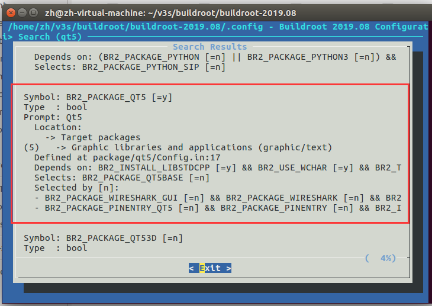
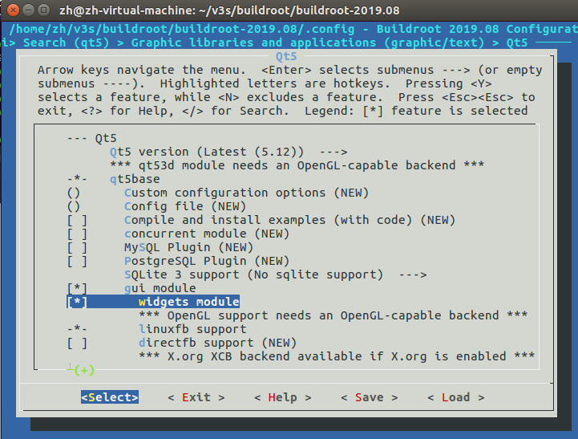

### QT5

```bash
$ cd ./buildroot

# 启用 QT5
$ make menuconfig

# 构建 rootfs
# 编译完成后会生成 output/images/rootfs.tar
$ make
```





## 更新 rootfs

```bash
# 删除 sd 卡里的文件
$ sudo rm -rf /media/zh/rootfs/*

$ find ./ -name rootfs.tar
./v3s/buildroot/buildroot-2019.08/output/images/rootfs.tar
./v3s/spi_nand/rootfs.tar
./v3s/QT/rootfs.tar
./v3s/img/rootfs.tar

# 解压 rootfs 至卡 sd 卡
$ sudo tar xf ./v3s/buildroot/buildroot-2019.08/output/images/rootfs.tar -C /media/zh/rootfs/
```

