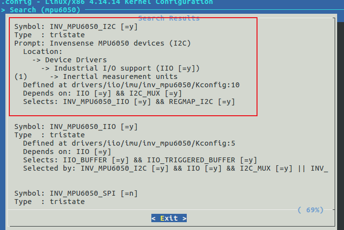

## 设备树



`sun8i-v3s-licheepi-zero.dts` 

此处需要配置中断引脚，不然初始化时会报错 -22。

```c
&i2c0 {
	status = "okay";

	mpu6050@68 {
		compatible = "invensense,mpu6050";
		reg = <0x68>;
		interrupt-parent = <&pio>;
		interrupts = <6 3 IRQ_TYPE_EDGE_FALLING>; /* PG3 */
		mount-matrix = "-0.984807753012208",  /* x0 */
		               "0",                   /* y0 */
		               "-0.173648177666930",  /* z0 */
		               "0",                   /* x1 */
		               "-1",                  /* y1 */
		               "0",                   /* z1 */
		               "-0.173648177666930",  /* x2 */
		               "0",                   /* y2 */
		               "0.984807753012208";   /* z2 */
	};

};
```

## 测试

```bash
$ cd /sys/bus/i2c/devices/0-0068/iio:device1/

$ ls
buffer                        in_anglvel_y_calibbias
current_timestamp_clock       in_anglvel_y_raw
dev                           in_anglvel_z_calibbias
in_accel_matrix               in_anglvel_z_raw
in_accel_mount_matrix         in_gyro_matrix
in_accel_scale                in_temp_offset
in_accel_scale_available      in_temp_raw
in_accel_x_calibbias          in_temp_scale
in_accel_x_raw                name
in_accel_y_calibbias          of_node
in_accel_y_raw                power
in_accel_z_calibbias          sampling_frequency
in_accel_z_raw                sampling_frequency_available
in_anglvel_mount_matrix       scan_elements
in_anglvel_scale              subsystem
in_anglvel_scale_available    trigger
in_anglvel_x_calibbias        uevent
in_anglvel_x_raw

# read device name
$ cat name
mpu6050

# read raw gyro
$ cat in_anglvel_x_raw in_anglvel_y_raw in_anglvel_z_raw
-79
-8
-21

# read raw accel
$ cat in_accel_x_raw in_accel_y_raw in_accel_z_raw
-14520
-4890
-3500
```

