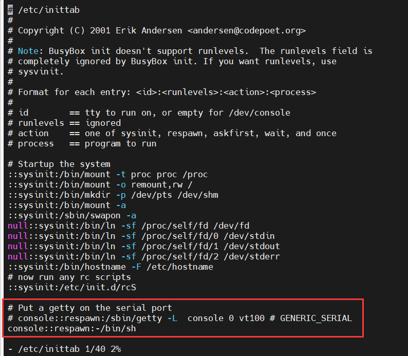

## 默认用户

```
username:root
password:123456
```

##  免密登录

[参考](https://wiki.sipeed.com/soft/Lichee/zh/Zero-Doc/System_Development/buildroot.html) 

```bash
$ vi /etc/inittab

# 免密登录
#console::respawn:/sbin/getty -L  console 0 vt100 # GENERIC_SERIAL
console::respawn:-/bin/sh
```




