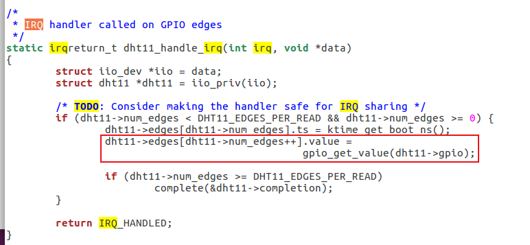

1. menuconfig

```
Kernel Features 
    Timer frequency (1000 Hz)

Device Drivers
    <*> Industrial I/O support
        <*> Humidity sensors
        	<*> DHT11 (and compatible sensors) drive
```

2. 修改设备树

`sun8i-v3s-licheepi-zero.dtb`

```
humidity_sensor {
    compatible = "dht11";
    gpios = <&pio 6 4 GPIO_ACTIVE_HIGH>; /* PG4 */
};
```

3. 重新编译内核，更新设备树和zImage

4. 读取测试

* sysfs

```bash
$ ls  /sys/bus/iio/devices/iio:device0
dev                        of_node
in_humidityrelative_input  power
in_temp_input              subsystem
name                       uevent

# 读取温湿度
$ cat /sys/bus/iio/devices/iio:device0/in_humidityrelative_input
$ cat /sys/bus/iio/devices/iio:device0/in_temp_input
```

* c test

```bash
$ make
$ make install
$ ./dht11
```

## 注意

```bash
$ cat /sys/bus/iio/devices/iio:device0/in_temp_input
[  906.274071] dht11 humidity_sensor: Only 24 signal edges detected
[  907.362066] dht11 humidity_sensor: Only 10 signal edges detected
cat: read error: Connection timed out
```

若 Timer frequency  = 1000 Hz，还是报 Only n signal edges detected，可能原因是系统中断响应处理速度不够。（因此该内核模块测试失败）


