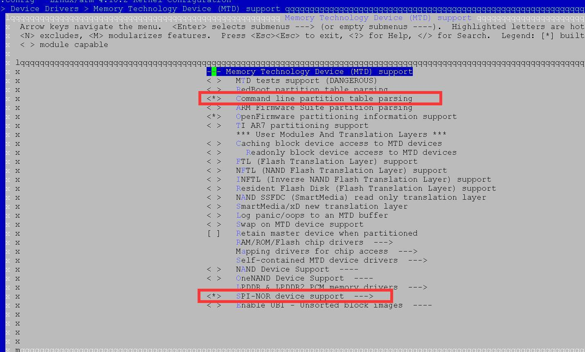
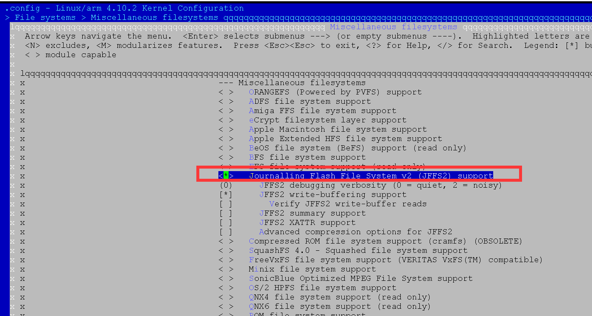

## Uboot编译配置


首先规划flash分区，我测试用的flash大小为16M，型号为MX25L12873F，规划如下：

```
[第一分区1MB存放spl和uboot] 0x000000000000-0x000000100000 : "uboot"
[第二分区64KB存放dtb文件] 0x000000100000-0x000000110000 : "dtb"
[第三分区4MB存放内核] 0x000000110000-0x000000510000 : "kernel"
[剩余空间存放根文件系统] 0x000000510000-0x000001000000 : "rootfs"
```

由于目前Uboot环境变量固定存放在1MB位置之内，所有留给uboot的空间固定到flash前1MB的位置不变。每个分区的大小必须是擦除块大小的整数倍，MX25L12873F的擦除块大小是64KB。

### 准备uboot


下载包含spi驱动的体验版本uboot，该驱动目前尚未合并到主线

`git clone -b v3s-spi-experimental https://github.com/Lichee-Pi/u-boot.git`

执行 `make ARCH=arm menuconfig` 打开uboot菜单配置，进入到 Device Drivers \> SPI Flash Support

注意看一下自己flash的厂家名称，例如选上Macronix SPI flash support用来支持我测试用的 flash：MX25L12873F。

配置uboot默认环境变量，在文件 `include/configs/sun8i.h` 中添加默认bootcmd和bootargs的环境变量设置，注意添加的位置在 **“\#include &#60;configs/sunxi-common.h&#62;”** 的前边。


```
#define CONFIG_BOOTCOMMAND   "sf probe 0; "                           \
                          "sf read 0x41800000 0x100000 0x10000; "  \
                          "sf read 0x41000000 0x110000 0x400000; " \
                          "bootz 0x41000000 - 0x41800000"

#define CONFIG_BOOTARGS      "console=ttyS0,115200 earlyprintk panic=5 rootwait " \
                             "mtdparts=spi32766.0:1M(uboot)ro,64k(dtb)ro,4M(kernel)ro,-(rootfs) root=31:03 rw rootfstype=jffs2"
```

该环境变量通过在bootargs中增加mtdparts内核参数来告诉内核flash的分区设置信息，并通过
`root=31:03` 来告诉内核rootfs的位置。

```
sf read 0x41800000 0x100000 0x10000; //从flash0x100000（1MB）位置读取dtb放到内存0x41800000偏移处。
sf read 0x41000000 0x110000 0x400000; //从flash0x110000（1MB+64KB）位置读取dtb放到内存0x41000000偏移处。
bootz 0x41000000 （内核地址）- 0x41800000（dtb地址） 启动内核
```

### 编译uboot


`make ARCH=arm CROSS_COMPILE=arm-linux-gnueabihf- -j4`

## linux内核编译配置


linux内核基于github上的版本 <https://github.com/Lichee-Pi/linux.git>

执行 `make ARCH=arm menuconfig` 打开内核菜单配置，进入到
Device Drivers --\> Memory Technology Device (MTD) support，确保选择上mtd的
\<\*\> Command line partition table parsing
支持，该项目用来解析uboot传递过来的flash分区信息。



修改dts配置添加spi flash节点

> `vi arch/arm/boot/dts/sun8i-v3s-licheepi-zero.dts`

添加spi节点配置:

```
&spi0 {
        status ="okay";

        mx25l12805d:mx25l12805d@0 {
                compatible = "jedec,spi-nor";
                reg = <0x0>;
                spi-max-frequency = <50000000>;
                #address-cells = <1>;
                #size-cells = <1>;
        };

};
```


添加对jffs2文件系统的支持，路径在

File systems --\> Miscellaneous filesystems --\> Journalling Flash File System v2 (JFFS2) support



退出菜单配置并编译内核和dts

```
make ARCH=arm CROSS_COMPILE=arm-linux-gnueabihf- -j4
make ARCH=arm CROSS_COMPILE=arm-linux-gnueabihf- dtbs
```

## 准备镜像文件


首先选择rootfs文件系统，我是用的是群朋提供的最小根文件系统rootfs-brmin.tar.gz，大小只有3M左右，下载地址在

[https://pan.baidu.com/share/link?shareid=1432204556&uk=3658413294\#list/path=%2F](https://pan.baidu.com/share/link?shareid=1432204556&uk=3658413294#list/path=%2F)
> Lichee Zero\>zero_imager.zip

Flash支持jffs2文件系统格式，所以需要使用此该rootfs制作jffs2文件系统镜像;

下载jffs2文件系统制作工具
`apt-get install mtd-utils`

解压 rootfs-brmin.tar.gz
`tar xzvf rootfs-brmin.tar.gz`

总空间是 **16M-1M-64K-4M=0xAF0000**

`mkfs.jffs2 -s 0x100 -e 0x10000 -p 0xAF0000 -d rootfs/ -o jffs2.img`

页大小 **0x100 256** 字节,块大小 **0x10000 64k**

jffs2分区总空间 0xAF0000

jffs2.img是生成的文件系统镜像。

最后将uboot，dtb，kernel，rootfs打包成一个系统镜像，命令如下:

```
dd if=/dev/zero of=flashimg.bin bs=16M count=1
dd if=../ubootmainline/u-boot/u-boot-sunxi-with-spl.bin of=flashimg.bin bs=1K conv=notrunc
dd if=../zero41y/linux-zero-4.10.y/arch/arm/boot/dts/sun8i-v3s-licheepi-zero-dock.dtb of=flashimg.bin bs=1K seek=1024  conv=notrunc
dd if=../zero41y/linux-zero-4.10.y/arch/arm/boot/zImage of=flashimg.bin bs=1K seek=1088  conv=notrunc
dd if=../zero_imager/jffs2/jffs2.img of=flashimg.bin  bs=1K seek=5184  conv=notrunc
```

1.  生成一个空文件，大小是16MB
2.  将uboot添加到文件开头
3.  将dtb放到1M偏移处
4.  将kernel放到1M+64K偏移处
5.  将rootfs放到1M+64K+4M偏移处


> 偏移大小是seek，单位是KB。

执行完毕后生成镜像文件flashimg.bin

## 烧写镜像


下载sunxiflash烧写工具，

`git clone -b spi-rebase https://github.com/Icenowy/sunxi-tools.git`


> 请选择spi-rebase分支

进入工具目录执行　\**make*\*

Zero有一个usb下载模式称为fel模式。zero的启动顺序是先sd卡然后spi flash。如果sd卡启动检测失败（没有sd卡或者sd卡中没有启动ubootspl），然后spiflash也启动检测失败（没有spiflash或者spiflash中没有启动ubootspl），那么会自动进入fel模式。

所以当你的spiflash还没有启动镜像的时候你拔掉sd上电会自动进入fel模式。

如果你的spiflash已经有了启动镜像，那么需要在sd卡中烧入一个sunxi提供的启动工具（ `dd if=fel-sdboot.sunxi of=/dev/mmcblk0 bs=1024 seek=8` ），那么插入该sd卡启动会进入fel模式；还有另一种方法，擦除spiflash内容上点也会进入fel模式。

进入fel模式后使用usb数据线连接pc和zero,进入sunxi-tool目录

> 执行 `sudo ./sunxi-fel version` 会显示硬件版本信息。
> 执行 `sudo ./sunxi-fel spiflash-info` 会显示spi flash信息。

执行如下命令烧入我们前边制作好的镜像文件

`sudo ./sunxi-fel -p spiflash-write 0 ../bootimg/flashimg.bin`


等待大概5分钟，烧写完成，如果没有意外重新上电zero那么就会进入linux系统了，账号是root没有密码。


