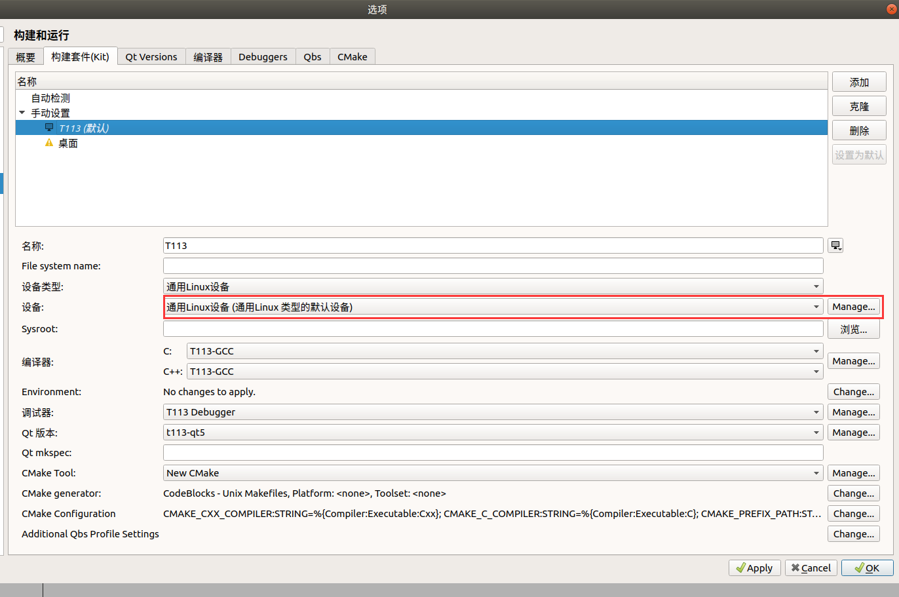
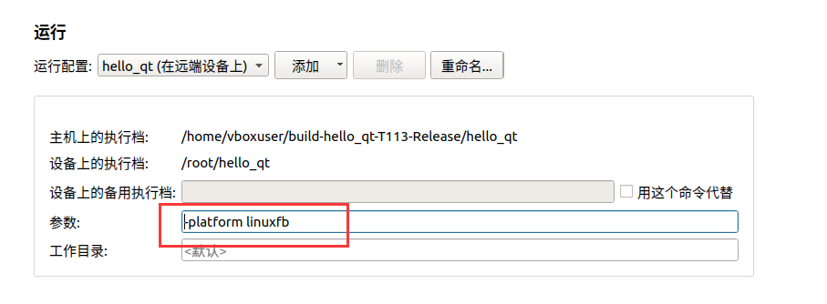

# QT Creator

[参考文档](https://doc.embedfire.com/linux/rk356x/Qt/zh/latest/lubancat_qt/install/remote_connect.html) 

# 环境搭建

```bash
# 安装 qtcreator
$ apt-get install qtcreator
```

## 构建和运行

### Debugger


### 编译器


### QMake


### CMake


### 构建套件 Kit


### 远程设备




地址为 SSH 地址。点击 Test 测试连接是否正常。

# 远程部署

## SFTP 上传

在 .pro 文件添加

```c
target.path = /root
INSTALLS += target
```


## 可执行文件

```
-platform linuxfb
```



## 环境变量

```
LD_LIBRARY_PATH=/usr/local/Qt_5.12.5/lib
QT_QPA_FONTDIR=/usr/local/Qt_5.12.5/fonts
QT_QPA_PLATFORM=linuxfb
QT_QPA_PLATFORM_PLUGIN_PATH=/usr/local/Qt_5.12.5/plugins
QT_ROOT=/usr/local/Qt_5.12.5
```


