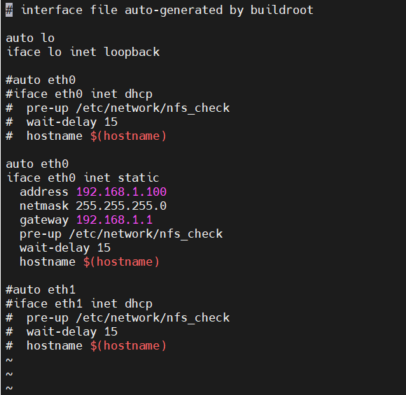
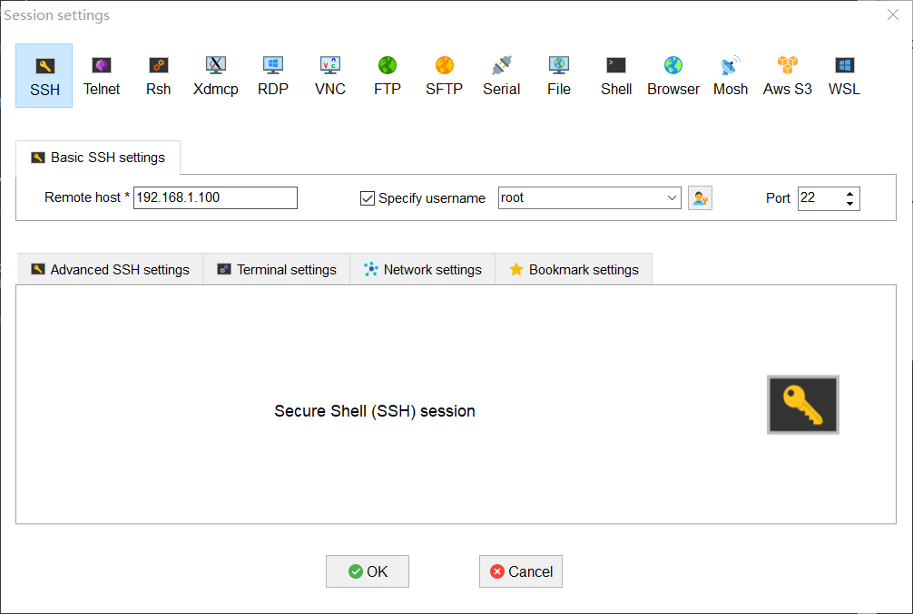

# 分配静态 IP

```bash
# 编辑网络配置文件
$ vi /etc/network/interfaces
auto eth0
iface eth0 inet static
  address 192.168.1.100
  netmask 255.255.255.0
  gateway 192.168.1.1
  pre-up /etc/network/nfs_check
  wait-delay 15
  hostname $(hostname)

# 重启开发板
$ reboot
```



# 分配动态 IP

从 DHCP 服务器获取 IP 地址

```
udhcpc -i eth0
```

# SSH 登录




