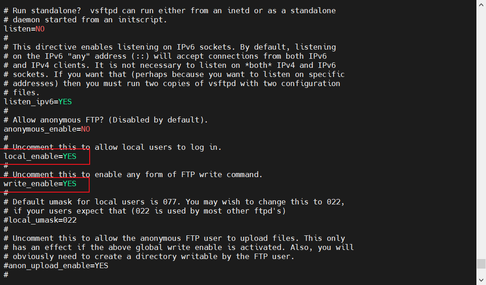
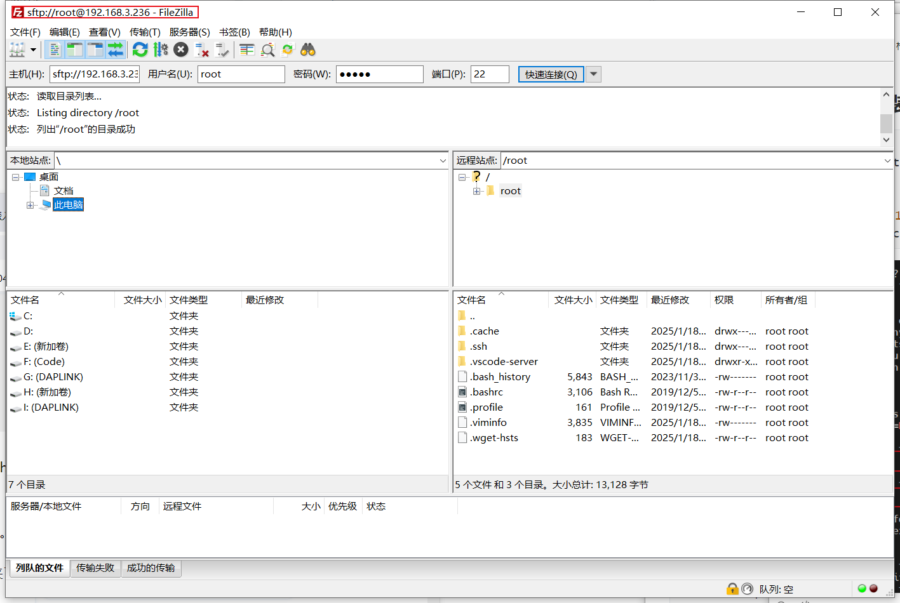

### FTP 传输文件

#### Ubuntu 安装 FTP服务

```bash
# 安装 vsftpd
$ sudo apt-get install vsftpd

# 编辑配置文件
# 去掉行28和行31前的`#`
$ sudo vi /etc/vsftpd.conf
```



```bash
# 查看ip地址
$ ifconfig

lo: flags=73<UP,LOOPBACK,RUNNING>  mtu 65536
        inet 127.0.0.1  netmask 255.0.0.0
        inet6 ::1  prefixlen 128  scopeid 0x10<host>
        loop  txqueuelen 1000  (Local Loopback)
        RX packets 1526  bytes 146897 (146.8 KB)
        RX errors 0  dropped 0  overruns 0  frame 0
        TX packets 1526  bytes 146897 (146.8 KB)
        TX errors 0  dropped 0 overruns 0  carrier 0  collisions 0

wlan0: flags=4163<UP,BROADCAST,RUNNING,MULTICAST>  mtu 1500
        inet 192.168.3.236  netmask 255.255.255.0  broadcast 192.168.3.255
        inet6 fe80::6575:3a1d:5af2:8b35  prefixlen 64  scopeid 0x20<link>
        inet6 240e:3b7:324f:29d0:359d:967d:bcf9:1f4b  prefixlen 64  scopeid 0x0<global>
        inet6 240e:3b7:324f:29d0:14e:71ee:ffce:4047  prefixlen 64  scopeid 0x0<global>
        inet6 240e:3b7:324f:29d0:4459:e3cb:89ee:6  prefixlen 128  scopeid 0x0<global>
        ether c0:f5:35:fa:e0:e5  txqueuelen 1000  (Ethernet)
        RX packets 16845  bytes 21936419 (21.9 MB)
        RX errors 0  dropped 0  overruns 0  frame 0
        TX packets 6387  bytes 496120 (496.1 KB)
        TX errors 0  dropped 0 overruns 0  carrier 0  collisions 0
```

#### Windows 安装 FileZilla

> 确保电脑和开发板在同一局域网内

主机：192.168.3.236

用户名：root 

端口：22



