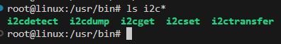

# i2c-tools

## build

1. 下载[软件包](https://mirrors.edge.kernel.org/pub/software/utils/i2c-tools/)，并复制到开发板内。

2. 编译&移植

```bash
# 进入 Makefile 所在目录
$ cd ./i2c-tools-4.4

# 静态编译
$ make USE_STATIC_LIB=1

$ ls i2c-tools-4.4/tools
i2cdetect i2cdump i2cget i2cset i2ctransfer
```

将以上所生成的工具复制到 `/usr/bin/`  内



## usage

```bash
# 列举 i2c 设备
$ ls /dev/i2c-*
/dev/i2c-0  /dev/i2c-2  /dev/i2c-3  /dev/i2c-4  /dev/i2c-6

# 显示总线上的设备
i2cdetect -y -r 2
```

## example

* oled ssd1306 填充测试

```bash
i2cdetect -y 2
     0  1  2  3  4  5  6  7  8  9  a  b  c  d  e  f
00:                         -- -- -- -- -- -- -- --
10: -- -- -- -- -- -- -- -- -- -- -- -- -- -- -- --
20: -- -- -- -- -- -- -- -- -- -- -- -- -- -- -- --
30: -- -- -- -- -- -- -- -- -- -- -- -- 3c -- -- --
40: -- -- -- -- -- -- -- -- -- -- -- -- -- -- -- --
50: -- -- -- -- -- -- -- -- -- -- -- -- -- -- -- --
60: -- -- -- -- -- -- -- -- -- -- -- -- -- -- -- --
70: -- -- -- -- -- -- -- --

# 全亮
$ bash oled_fill.sh 0xff
OLED_Init start
OLED_Init end

# 条纹点亮
$ bash oled_fill.sh 0xf0
OLED_Init start
OLED_Init end

# 全灭
$ bash oled_fill.sh 0x00
OLED_Init start
OLED_Init end
```

 `oled_fill.sh`：

```sh
#! file: oled_fill.sh
#! /bin/bash

log_debug(){
	# echo $1
	return
}

log_info(){
	echo $1
}

I2C_WriteByte(){
	log_debug "i2cset -y 2 0x3c $1 $2"
	i2cset -y 2 0x3c $1 $2 
	log_debug "ret = $?"
}

WriteCmd(){
	I2C_WriteByte 0x00 $1
}

WriteDat(){
	I2C_WriteByte 0x40 $1
}

OLED_Init(){
	log_info "OLED_Init start"
	WriteCmd  0xAE    # display off
	WriteCmd  0x20    # Set Memory Addressing Mode	
	WriteCmd  0x10    # 00,Horizontal Addressing Mode;01,Vertical Addressing Mode;10,Page Addressing Mode   RESET);11,Invalid
	WriteCmd  0xb0    # Set Page Start Address for Page Addressing Mode,0-7
	WriteCmd  0xc8    # Set COM Output Scan Direction
	WriteCmd  0x00    # ---set low column address
	WriteCmd  0x10    # ---set high column address
	WriteCmd  0x40    # --set start line address
	WriteCmd  0x81    # --set contrast control register
	WriteCmd  0xff    # 亮度调节 0x00~0xff
	WriteCmd  0xa1    # --set segment re-map 0 to 127
	WriteCmd  0xa6    # --set normal display
	WriteCmd  0xa8    # --set multiplex ratio  1 to 64)
	WriteCmd  0x3F    # 
	WriteCmd  0xa4    # 0xa4,Output follows RAM content;0xa5,Output ignores RAM content
	WriteCmd  0xd3    # -set display offset
	WriteCmd  0x00    # -not offset
	WriteCmd  0xd5    # --set display clock divide ratio/oscillator frequency
	WriteCmd  0xf0    # --set divide ratio
	WriteCmd  0xd9    # --set pre-charge period
	WriteCmd  0x22    # 
	WriteCmd  0xda    # --set com pins hardware configuration
	WriteCmd  0x12    # 
	WriteCmd  0xdb    # --set vcomh
	WriteCmd  0x20    # 0x20,0.77xVcc
	WriteCmd  0x8d    # --set DC-DC enable
	WriteCmd  0x14    # 
	WriteCmd  0xaf    # --turn on oled panel
	log_info "OLED_Init end"
}

# 全屏填
OLED_Fill()
{
	for m in $(seq 0 7)
	do
		WriteCmd $((  0xb0+$m ))
		WriteCmd 0x00
		WriteCmd 0x10
		# 此处不知道什么原因，循环次数为127的时候屏幕右侧有一部分无法点亮
		# 所以循环次数修改为129次，之后在研究原因
		for n in $(seq 0 129) 
		do
			WriteDat $1
		done
	done
}

OLED_Init
OLED_Fill $1
```


