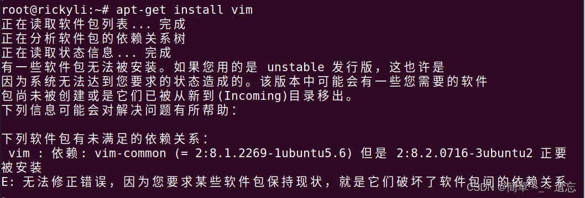
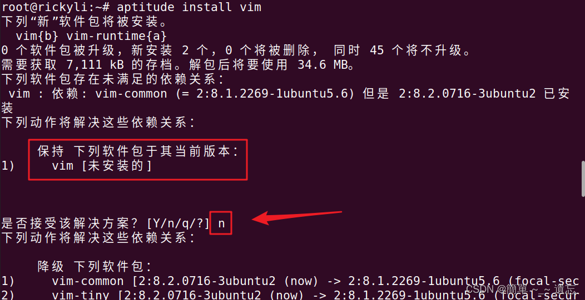
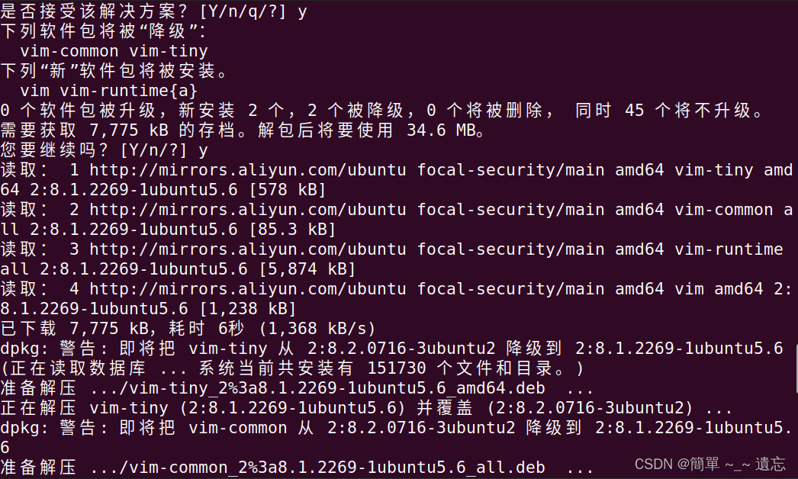
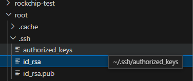

# SSH

## 启动服务

```bash
$ sudo -i

# 检查是否有ssh环境 
# 客户端 agent, 服务端 sshd
# 此处无 sshd，说明需要安装ssh环境
$ ps -e | grep ssh
root@localhost:~# ps -e | grep ssh
    925 ?        00:00:00 ssh-agent
    
# 更新软件列表和更新软件
$ sudo apt-get update
$ sudo apt-get upgrade

# 安装 ssh (若无法安装请参考`降级安装`小节)
$ apt-get install ssh

# 启动ssh服务
$ sudo /etc/init.d/ssh start

# 再次检查是否有ssh环境
$ ps -e | grep ssh
root@localhost:~# ps -e | grep ssh
    925 ?        00:00:00 ssh-agent
   4032 ?        00:00:00 sshd
   
# 开启root用户, 并设置密码
$ sudo passwd root

# 修改root密码(忘记root密码时刻使用)
$ sudo passwd

# 修改ssh服务配置文件
# 找到 '#PermitRootLogin prohibit-password'
# 改为 'PermitRootLogin yes'
$ sudo vi /etc/ssh/sshd_config

# 重启ssh服务(二选一)
$ service sshd restart
$ /etc/initd.d/sshd restart
```

### 降级安装

```bash
# 安装 aptitude
$ apt-get install -y aptitude

# 安装 ssh
$ aptitude install ssh
```

安装软件包时报错：`ubuntu 无法修正错误，因为您要求某些软件包保持现状，就是它们破坏了软件包间的依赖关系`。

可以使用 aptitude 来帮助降级解决软件包的依赖版本。



在 使用 aptitude 安装软件包，安装过程中，第一个交互提示你是否**保持包版本不变**，即**不更新**，这里输入 **n**，后面的交互提示输入 **y** 即可。





## 远程登录（VSCode）

电脑和开发板需连接同一个wifi（局域网）

```bash
# 查看ip地址
$ ifconfig

lo: flags=73<UP,LOOPBACK,RUNNING>  mtu 65536
        inet 127.0.0.1  netmask 255.0.0.0
        inet6 ::1  prefixlen 128  scopeid 0x10<host>
        loop  txqueuelen 1000  (Local Loopback)
        RX packets 1526  bytes 146897 (146.8 KB)
        RX errors 0  dropped 0  overruns 0  frame 0
        TX packets 1526  bytes 146897 (146.8 KB)
        TX errors 0  dropped 0 overruns 0  carrier 0  collisions 0

wlan0: flags=4163<UP,BROADCAST,RUNNING,MULTICAST>  mtu 1500
        inet 192.168.3.236  netmask 255.255.255.0  broadcast 192.168.3.255
        inet6 fe80::6575:3a1d:5af2:8b35  prefixlen 64  scopeid 0x20<link>
        inet6 240e:3b7:324f:29d0:359d:967d:bcf9:1f4b  prefixlen 64  scopeid 0x0<global>
        inet6 240e:3b7:324f:29d0:14e:71ee:ffce:4047  prefixlen 64  scopeid 0x0<global>
        inet6 240e:3b7:324f:29d0:4459:e3cb:89ee:6  prefixlen 128  scopeid 0x0<global>
        ether c0:f5:35:fa:e0:e5  txqueuelen 1000  (Ethernet)
        RX packets 16845  bytes 21936419 (21.9 MB)
        RX errors 0  dropped 0  overruns 0  frame 0
        TX packets 6387  bytes 496120 (496.1 KB)
        TX errors 0  dropped 0 overruns 0  carrier 0  collisions 0

```

[SSH免密登录_VSCode.pdf](res\ssh\SSH免密登录_VSCode.pdf) 

SSH登录地址：root@192.168.3.236 

对应密钥位置：

