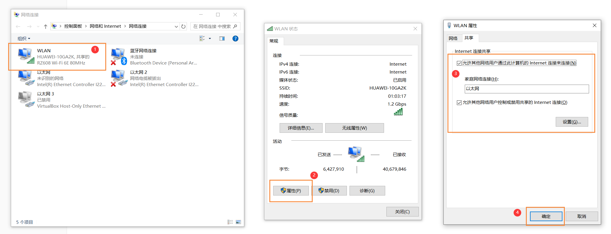
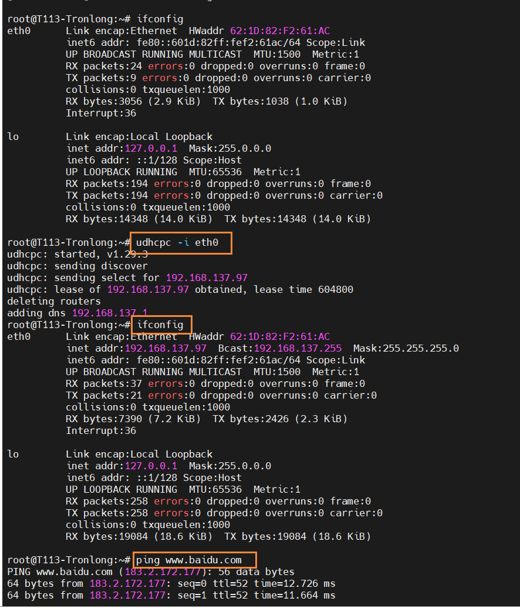
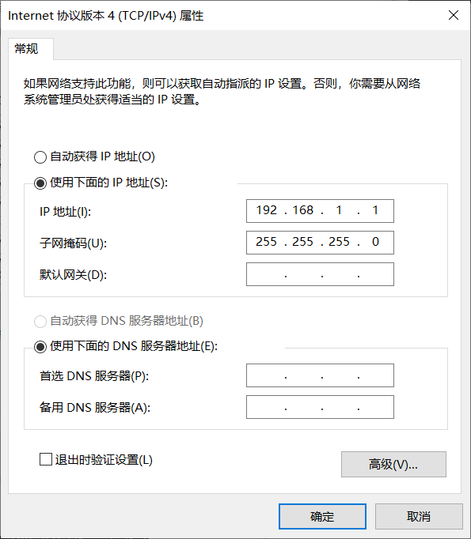
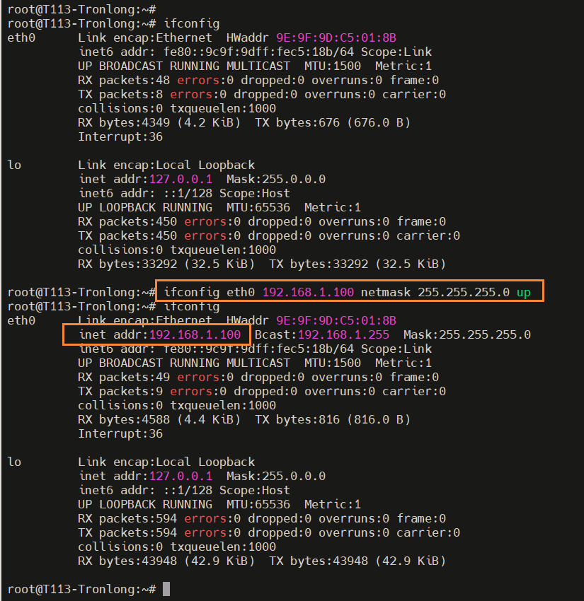
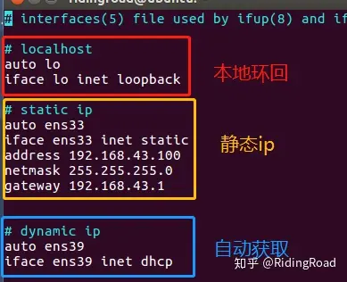

# IP 地址分配

## 动态地址

### 共享网络

电脑共享网络给评估板（WiFi - PC - EVK）



从 DHCP 服务器获取 IP 地址

```
udhcpc -i eth0
```



```
auto eth0
iface eth0 inet static
address 192.168.137.13
gateway 192.168.137.1
netmask 255.255.255.0
```

## 静态地址



### 临时分配

当重启电脑后，ip地址将恢复为原来的ip地址，此方法适合临时测试使用

```bash
# 分配静态IP地址
ifconfig eth0 192.168.1.100 netmask 255.255.255.0 up
```



### 永久分配

1. 修改配置文件

Ubuntu系统进行网络配置涉及到的配置文件

* /etc/network/interfaces IP 等信息的配置文件

* /etc/resolv.conf DNS 服务器的配置文件

目前是修改IP地址信息，那么我们对/etc/network/interfaces进行修改即可

```bash
vi /etc/network/interfaces
```

静态ip配置，常用于桥接模式下用于于主机通讯.其他设置可以参照下图：

```
auto eth0
iface eth0 inet static
  address 192.168.1.100
  netmask 192.168.1.1
  gateway 255.255.255.0
  pre-up /etc/network/nfs_check
  wait-delay 15
  hostname $(hostname)
```



2. 重启服务

```bash
# 重启服务（二选一）
# 若系统不支持该命令，重启系统即可 
$ sudo /etc/init.d/networking restart
$ sudo service networking restart
```

