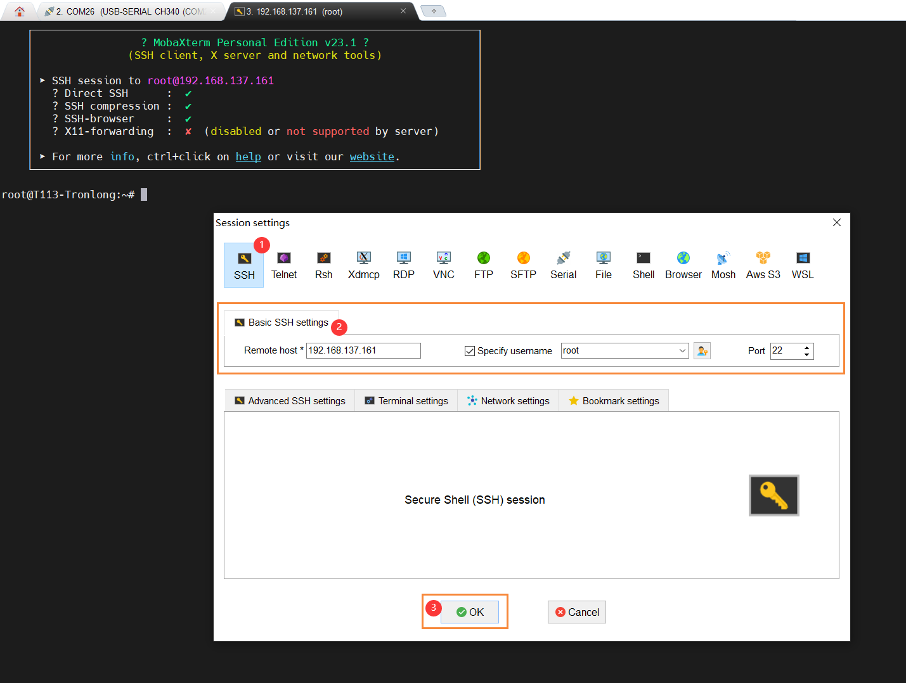

# SSH

## 安装服务

```bash
sudo apt-get update

# 安装 ssh 服务
sudo apt-get install openssh-client
sudo apt-get install openssh-server
```

## 启动服务

```bash
# 启动 ssh 服务
/etc/init.d/ssh start

# 查看 ssh 服务是否启动
ps -e | grep ssh
 1412 ?        00:00:00 sshd
 1506 ?        00:00:00 sshd
 1542 ?        00:00:00 sshd
```

## 远程登录

需确保开发板和电脑处于相同的局域网。[MobaXterm](https://mobaxterm.mobatek.net/download.html) 

```bash
# 查看 IP 地址
ifconfig

eth0      Link encap:Ethernet  HWaddr 12:98:0D:D9:24:F9
          inet addr:192.168.137.161  Bcast:192.168.137.255  Mask:255.255.255.0
          inet6 addr: fe80::1098:dff:fed9:24f9/64 Scope:Link
          UP BROADCAST RUNNING MULTICAST  MTU:1500  Metric:1
          RX packets:478 errors:0 dropped:0 overruns:0 frame:0
          TX packets:404 errors:0 dropped:0 overruns:0 carrier:0
          collisions:0 txqueuelen:1000
          RX bytes:75296 (73.5 KiB)  TX bytes:49013 (47.8 KiB)
          Interrupt:36

lo        Link encap:Local Loopback
          inet addr:127.0.0.1  Mask:255.0.0.0
          inet6 addr: ::1/128 Scope:Host
          UP LOOPBACK RUNNING  MTU:65536  Metric:1
          RX packets:322 errors:0 dropped:0 overruns:0 frame:0
          TX packets:322 errors:0 dropped:0 overruns:0 carrier:0
          collisions:0 txqueuelen:1000
          RX bytes:23820 (23.2 KiB)  TX bytes:23820 (23.2 KiB)
```



