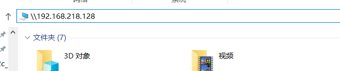

# Samba

方便地在Windows系统里访问Ubuntu的文件和文件夹

```bash
sudo su

# 安装 Samba
apt-get install samba

# 配置共享目录
vim /etc/samba/smb.conf

[ubuntu]
# 设置允许访问的目录
path = /home
available = yes
browseable = yes
public = yes
writable = yes
# 设置允许访问的用户
valid users = linux_username

# 设置访问的密码
smbpasswd -a linux_username

# 重启smb服务器
/etc/init.d/smbd restart

# 获取 IP
ifconfig
ens33     Link encap:Ethernet  HWaddr 00:0c:29:69:16:b4  
          inet addr:192.168.218.128  Bcast:192.168.218.255  Mask:255.255.255.0
          inet6 addr: fe80::da0c:2079:bbd9:eb0e/64 Scope:Link
          UP BROADCAST RUNNING MULTICAST  MTU:1500  Metric:1
          RX packets:4733 errors:0 dropped:0 overruns:0 frame:0
          TX packets:916 errors:0 dropped:0 overruns:0 carrier:0
          collisions:0 txqueuelen:1000 
          RX bytes:4749697 (4.7 MB)  TX bytes:84847 (84.8 KB)
```


在 Windows 系统输入ip地址并输入账号和密码就可以访问Ubuntu下的目录




在 Windows 浏览器里对Ubuntu目录点击右键，选择“映射网络驱动器”，并指定驱动器号


以后就可以像访问Windows目录一样访问Ubuntu目录

