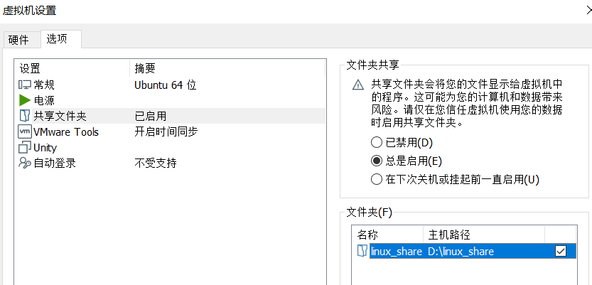
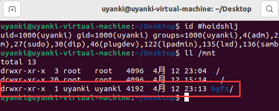
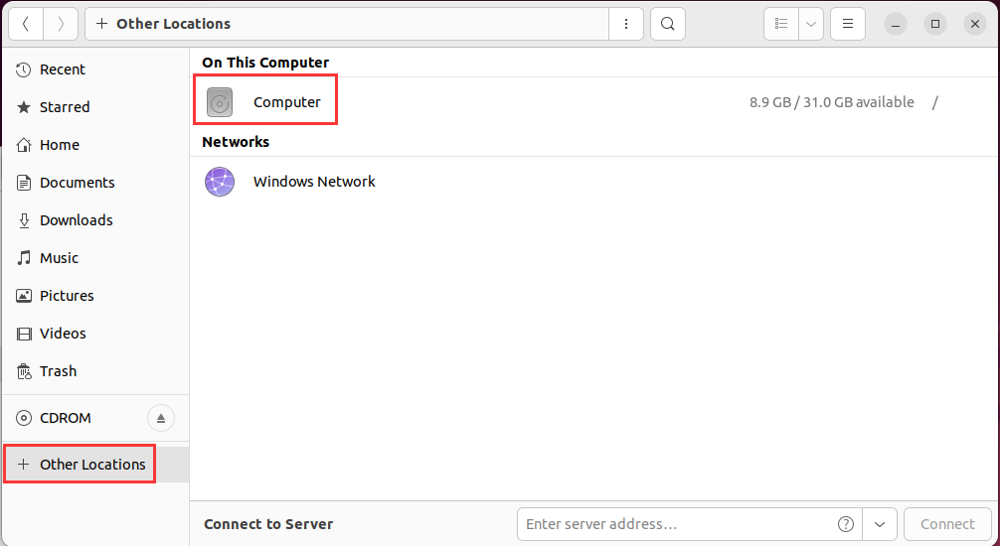
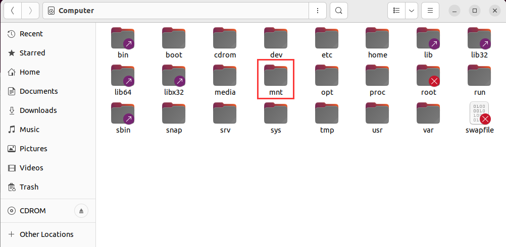
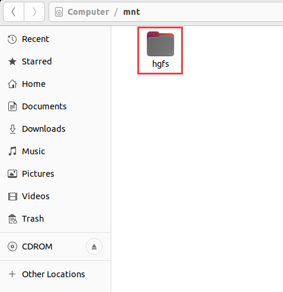
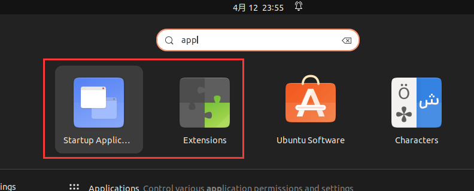
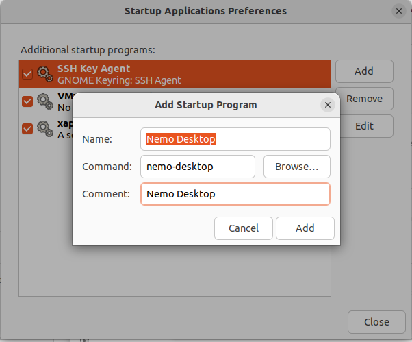
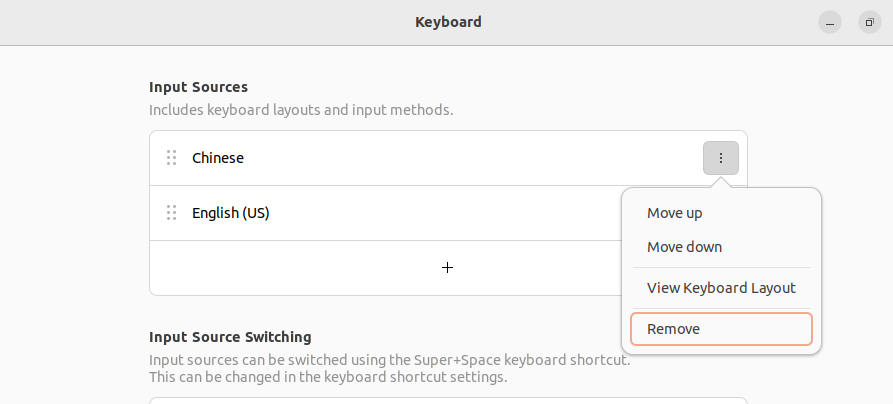
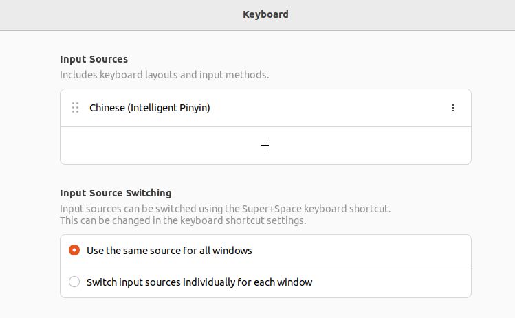

From：

https://blog.csdn.net/weixin_45813658/article/details/124773315

https://blog.csdn.net/slampai/article/details/128185055

##### 重装 vmtool

卸载先前安装的 vmtool 和 open-vm-tools

```shell
sudo vmware-uninstall-tools.pl
sudo apt-get remove open-vm-tools
sudo apt-get remove --auto-remove open-vm-tools
sudo apt-get purge open-vm-tools
sudo apt-get purge --auto-remove open-vm-tools
```

重新安装 open-vm-tools 和 open-vm-tools-desktop

```shell
sudo apt install open-vm-tools*
```

##### 挂载文件夹

关闭虚拟机，设置共享文件夹



如已挂载 hgfs，需先取消挂载

```shell
sudo umount /mnt/hgfs
```

查询 home目录下查询 uid，gid 和 umask

```shell
id
```

重新挂载 hgfs（根据上一步的查询结果，更新下一个命令中 uid，gid 和 umask 值）

```
sudo /usr/bin/vmhgfs-fuse .host:/ /mnt/hgfs -o allow_other -o uid=1000 -o gid=1000 -o umask=022
```

若提示 fuse：mountpoint is not empt，更换成以下指令：

```
sudo /usr/bin/vmhgfs-fuse .host:/ /mnt/hgfs -o nonempty -o allow_other -o uid=1000 -o gid=1000 -o umask=022
```

查询 /mnt 路径下文件权限，通常情况下，hgfs 文件夹的所有者变成了当前的 Linux 用户名。



##### 开机自挂载

因重启后权限会变回去，因此需设置开机自动挂载。

打开配置文件

```
sudo gedit /etc/fstab 
```

写入以下内容

```
.host:/ /mnt/hgfs   fuse.vmhgfs-fuse  allow_other,uid=1000,gid=1000,umask=022  0 0
```

##### 共享文件夹







##### 文件拖拽

```shell
sudo apt install gnome-shell-extension-prefs
sudo apt install nemo
```

左下角搜索：



将 extension 中的 Desktop icons NG 关闭

在 startup application preference 添加以下内容

```
Nemo Desktop
nemo-desktop
```



##### 切换系统语言

`Settings -> Region & Language -> Language -> chinese (china) -> restart`

！！不建议把默认文件夹改为中文名

如不慎修改，有两方法修改回来英文：

① 切换语言

```shell
$ export LANG=en_US
$ xdg-user-dirs-gtk-update
```

② 编辑文件

将文件夹名改回英文，然后修改 `user-dirs.dirs` 中的文件内容

```shell
$ gedit ~/.config/user-dirs.dirs

XDG_DESKTOP_DIR="$HOME/Desktop"
XDG_DOWNLOAD_DIR="$HOME/Downloads"
XDG_TEMPLATES_DIR="$HOME/Templates"
XDG_PUBLICSHARE_DIR="$HOME/Public"
XDG_DOCUMENTS_DIR="$HOME/Documents"
XDG_MUSIC_DIR="$HOME/Music"
XDG_PICTURES_DIR="$HOME/Pictures"
XDG_VIDEOS_DIR="$HOME/Videos"
```

##### 中文输入法

安装输入法：

```shell
sudo apt-get install ibus-pinyin
```

添加输入法：

`Settings -> Keyboard -> Input Sources -> + -> Chinese -> Chinese (Intelligent Pinyin)`

---

若 Chinese  已存在，则新添任意语言，如 English（US），然后移除 Chinese。



新添 Chinese（Intelligent Pinyin），移除 English（US）



---

##### 取消休眠

`Settings -> Power -> Power Saving Options -> Screen Blank -> Never`