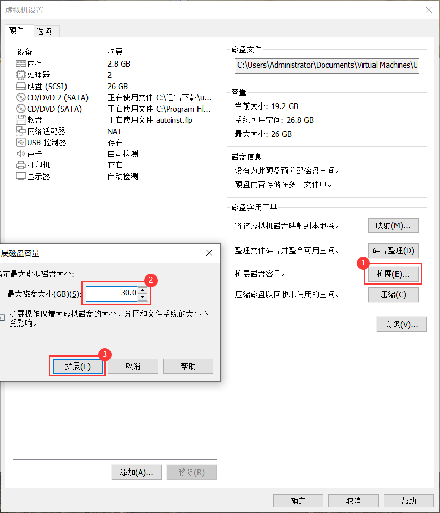
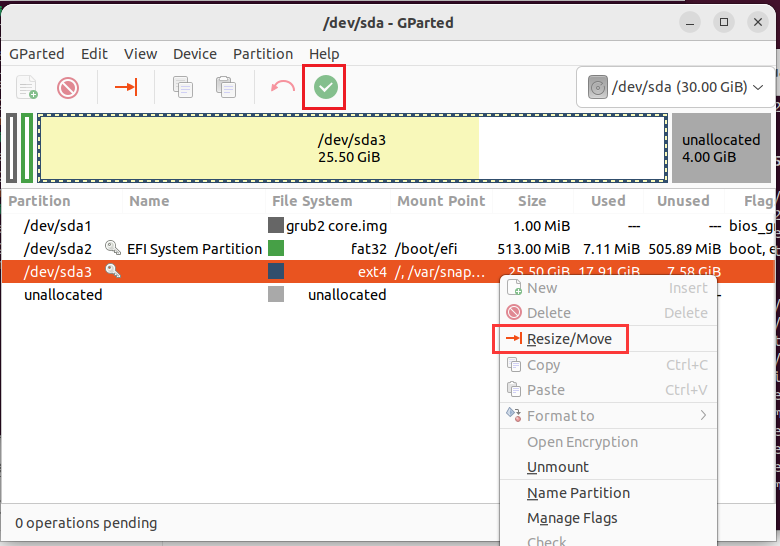
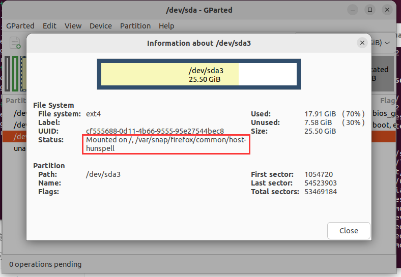
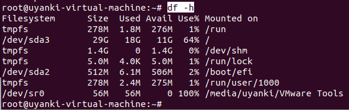

#### 内存分配



#### 图形化工具

* 安装

```shell
sudo apt-get install gparted
```

* 运行

```shell
sudo gparted
```

* 分配



若提示 `cannot resize read-only file system`，则需更改挂载文件夹目录的读写权限



```shell
sudo -i
mount -o remount -rw /
mount -o remount -rw /var/snap/firefox/common/host-hunspell
```

#### 分区信息

```shell
df -h
```

